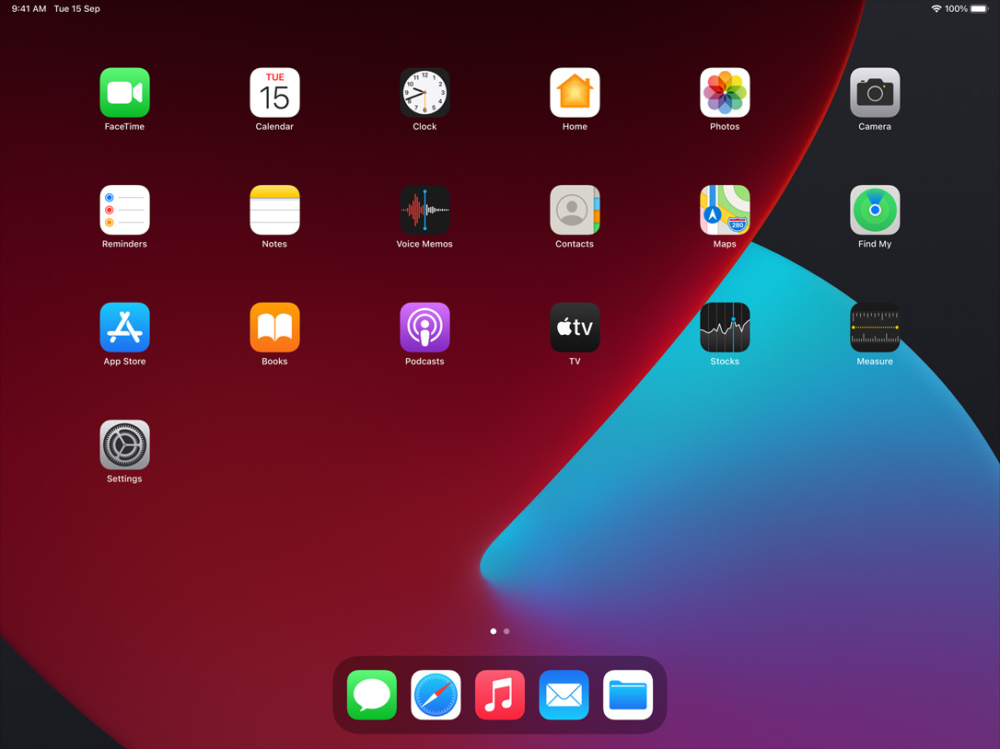

# My macOS

What I installed in my macOS

**Explanation**

       means Apple's App
📱      means iOS available
     means iPadOS available

* [Applications](#applications)
    * [Business](#business)
    * [Developer](#developer)
    * [Education](#education)
    * [Graphics](#graphics)
    * [Music](#music)
    * [News](#news)
    * [Productivity](#productivity)
    * [Reference](#reference)
    * [Social](#social)
    * [Utilities](#utilities)
* [Command Line](#command-line)
* [iPadOS](#iPadOS-)
* [iOS](#iOS-)

## Applications
#Business
#### [Aruba VIA](https://www.arubanetworks.com) 📱  
 -The Aruba Virtual Intranet Access (VIA) client is a secure VPN service for users who need corporate connectivity at home, temporary sites, or while they're mobile.
### Developer
#### [Xcode](https://developer.apple.com/xcode) 
 -Xcode is Apple's integrated development environment for macOS, used to develop software for macOS, iOS, iPadOS, watchOS, and tvOS.
#### [TestFlight](https://developer.apple.com/testflight/)  📱  
 -TestFlight makes it easy to invite users to test your apps and App Clips and collect valuable feedback before releasing your apps on the App Store.
#### [Developer](https://developer.apple.com)  📱  

#### [Dash](https://kapeli.com/dash) 📱 
 -Dash is an API Documentation Browser and Code Snippet Manager.
#### [Sublime Text](https://www.sublimetext.com)
 -Sublime Text is a sophisticated text editor for code, markup and prose.
#### [SubEthaEdit](https://subethaedit.net)
 -SubEthaEdit is a collaborative real-time editor.
#### [Pycharm](https://www.jetbrains.com/pycharm)
 -PyCharm is an integrated development environment used in computer programming, specifically for the Python language.
#### [JSON XML Format](https://apps.apple.com/sg/app/json-xml-format/id1512707568)

#### [Wireshark](https://www.wireshark.org)
 -Wireshark is a free and open-source packet analyzer.
#### [Charles](https://www.charlesproxy.com)
 -Charles is an HTTP proxy / HTTP monitor / Reverse Proxy that enables a developer to view all of the HTTP and SSL / HTTPS traffic between their machine and the Internet.
#### [Visual Studio Code](https://code.visualstudio.com)
 -Visual Studio Code is a source-code editor.
#### [Paw](https://paw.cloud)
 -Paw is a full-featured and beautifully designed Mac app that makes interaction with REST services delightful.
#### [iTerm](https://iterm2.com)
 -iTerm2 is a replacement for Terminal and the successor to iTerm.
#### [CodeRunner](https://coderunnerapp.com)
 -A lightweight, multi-language programming text editor and IDE for macOS.

 ### Education
#### [Anki](https://apps.ankiweb.net) 📱 
 -Anki is a program which makes remembering things easy.

 ### Graphics
#### [Final Cut Pro](https://www.apple.com/sg/final-cut-pro/) 
 -Final Cut Pro offers the most advanced organising tools of any professional video-editing application.
#### [iMovie](https://www.apple.com/sg/imovie/)  📱 
 -iMovie is a video editing software application.
#### [Affinity Designer](https://affinity.serif.com/en-gb/designer) 
 -Affinity Designer is a vector graphics editor.
#### [Affinity Photo](ihttps://affinity.serif.com/en-gb/photo) 
 -Affinity Photo is a raster graphics editor.
#### [Sketch](https://www.sketch.com)
 -Sketch is a vector graphics editor.
#### [Pixelmator Pro](https://www.pixelmator.com/pro/) 📱 
 -Pixelmator Pro includes a stunning collection of handcrafted dual-texture brushes, full graphics tablet support, and advanced paint blending technologies.
#### [DaVinci Resolve](https://www.blackmagicdesign.com/sg/products/davinciresolve)
 -DaVinci Resolve is a color correction and non-linear video editing application.
#### [IINA](https://iina.io)
 -IINA is a free and open-source media player.
#### [VLC](https://www.videolan.org) 📱 
 -VLC is a free and open source cross-platform multimedia player and framework that plays most multimedia files, and various streaming protocols.
#### [Vectornator](https://www.vectornator.io) 📱 
 -Vectornator is a graphic design software, developed by Linearity GmbH, that simplifies the design creation process for designers by providing intuitive tools & automating routine problems faced in the area.

 ### Music
#### [Logic Pro](https://www.apple.com/sg/logic-pro/) 
 -Logic Pro is a digital audio workstation and MIDI sequencer software application.
#### [MainStage](https://www.apple.com/sg/mainstage/) 
 -MainStage supports your addiction to knobs, buttons and faders. It can connect with just about any external MIDI device on the planet.
#### [GarageBand](https://www.apple.com/sg/mac/garageband/)  📱 
 -GarageBand is a line of digital audio workstations.
#### [Spotify](https://www.spotify.com/sg-en) 📱 

#### [VOX](https://vox.rocks) 📱 

### News
#### [NetNewsWire](https://netnewswire.com) 📱 
 -RSS reader and read later client

### Productivity
#### [Keynote](https://www.apple.com/sg/keynote/)  📱 
 -Keynote is a presentation software application.
#### [Numbers](https://www.apple.com/sg/numbers/)  📱 
 -Numbers is a spreadsheet application.
#### [Pages](https://www.apple.com/sg/pages/)  📱 
 -Pages is a word processor.
#### [Alfred](https://www.alfredapp.com)
 -Alfred is an application launcher and productivity application.
#### [2Do](https://www.2doapp.com/mac) 📱 
 -2Do was designed to meet your need for speed. Quickly enter your thoughts and ideas before you forget.
#### [Tor Browser](https://www.torproject.org)
 -Tor, short for The Onion Router.
#### [FireFox](https://www.mozilla.org/en-US) 📱 
 -Browser.
#### [Google Chrome](https://www.google.com/chrome) 📱 
 -Browser.
 + extensions
 * [Evernote Web Clipper](https://evernote.com/features/webclipper) -Use the Evernote extension to save things you see on the web into your Evernote account.
 * [Notion Web Clipper](https://www.notion.so/web-clipper) -Use our Web Clipper to save any website into Notion.
 * [Zotero Connector](https://www.zotero.org/download/connectors) -Save references to Zotero from your web browser
#### [Dropbox](https://www.dropbox.com) 📱 
 -Dropbox is a file hosting service.
#### [Obsidian](https://obsidian.md) 📱 
 -Obsidian is a powerful knowledge base on top of a local folder of plain text Markdown files.
#### [Evernote](https://evernote.com) 📱 
 -Evernote is an app designed for note taking, organizing, task management, and archiving.
#### [Notability](https://www.gingerlabs.com) 📱 
 -Combine handwriting, photos and typing in a single note to bring your projects to life.
#### [GoodNotes](https://www.goodnotes.com) 📱 
 -Discover the note-taking app loved by students, digital planners, notetakers all over the world.
#### [Notion](https://www.notion.so) 📱  📱 💻
 -A new tool that blends your everyday work apps into one. It's the all-in-one workspace for you and your team.

### Reference
#### Eudic 欧路词典 📱 

### Social
#### [Telegram](https://telegram.org) 📱 

#### [Slack](https://slack.com/intl/en-sg) 📱 

#### [WhatsApp](https://www.whatsapp.com) 📱 

#### [Wechat](https://www.wechat.com) 📱 

### Utilities
#### [Blender](https://www.blender.org)
 -Blender is the free and open source 3D creation suite.
#### [Keka](https://www.keka.io)

#### [The Unarchiver](https://theunarchiver.com)

#### [Toggl Track](https://toggl.com/track) 📱

#### Kindle

#### OpenVPN Connect 📱 

## Command Line
[my dotfiles](https://github.com/asktao/dotfiles)

* [brew](https://brew.sh) Package Manager
* [ag](https://github.com/ggreer/the_silver_searcher)
* [jq](https://stedolan.github.io/jq/)
* [git](https://git-scm.com)
* [vim](https://www.vim.org)
* [tmux](https://tmux.github.io/)
* [nmap](https://nmap.org)

## [iPadOS ](https://github.com/asktao/iPadOS)
## [iOS 📱](https://github.com/asktao/iOS)

